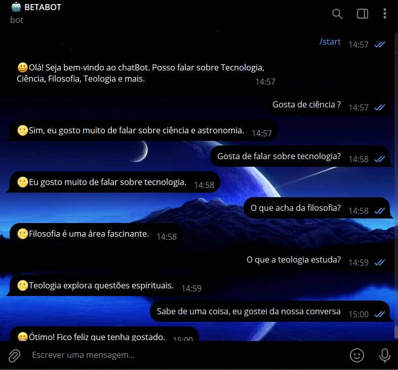
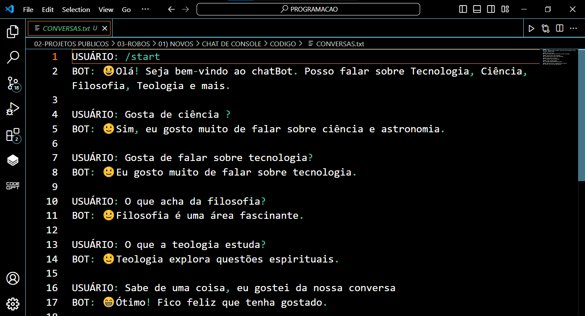

# CHAT DE CONSOLE EM TXT
🤤É UM BOT DO TELEGRAM DE BATE PAPO SOBRE TÓPICOS RELACIONADOS; QUE SALVA AS CONVERSAS EM "CONVERSAS.TXT"!

 <br>
 <br>

## DESCRIÇÃO:
O bot recebe mensagens de texto dos usuários e responde com informações relacionadas aos tópicos especificados e as salva em `CONVERSAS.txt`.

## FUNCIONALIDADES:
1. **Respostas Automáticas:** O bot responde a mensagens enviadas pelos usuários no Telegram.
2. **Identificação de Palavras-Chave:** Reconhece palavras-chave como "gosta de ciência", "tecnologia", "filosofia", "teologia" e outras para fornecer respostas específicas sobre esses temas.
3. **Mensagem de Início:** Ao receber "/start", "oi" ou "ola", o bot dá uma mensagem de boas-vindas e apresenta suas áreas de interesse.
4. **Salvamento de Conversas:** Todas as interações entre o usuário e o bot são salvas em um arquivo chamado "CONVERSAS.txt", localizado no mesmo diretório do script.

## EXECUTANDO O PROJETO:
1. **Coloque o Token:**
   - Antes de executar o programa, é necessário substituir o token do seu bot no arquivo `TOKEN.py`, o qual pode ser obtido por meio do [@BotFather](https://t.me/BotFather).

2. **Instalando as dependências:**
   - Antes de executar o bot, certifique-se de instalar todas as dependências necessárias. No terminal, execute o seguinte comando para instalar as dependências listadas no arquivo `requirements.txt` em `CODIGO`:
   ```bash
   pip install -r requirements.txt
   ```

3. **Inicie o Bot:**
   - Execute o bot do Telegram em Python iniciando-o com o seguinte comando:
   ```bash
   python CODIGO.py
   ```
   
   - Inicie o bot enviando o comando `/start`. Receba uma mensagem de boas-vindas e Converse.

4. **Interagir com o Bot:**
   - Envie mensagens como "gosta de ciência?", "filosofia", "tecnologia", entre outras relacionadas aos interesses do bot.
   - O bot responderá automaticamente com informações sobre esses temas ou com uma mensagem padrão caso não reconheça a mensagem.

5. **Comandos Disponíveis:**
   - `/start`, `oi`, `ola`: Inicia uma conversa com o bot e recebe uma mensagem de boas-vindas.
   - Mensagens contendo palavras-chave como "gosta de ciência", "tecnologia", "filosofia", "teologia": Ativa respostas específicas sobre esses assuntos.
   - Outras mensagens: Recebem uma resposta padrão indicando que o bot não compreendeu a mensagem.

6. **Visualizar Conversas Salvas:**
   - Todas as interações entre usuários e o bot são registradas no arquivo "CONVERSAS.txt" no mesmo diretório do script.
   - Você pode abrir este arquivo para revisar as conversas anteriores e as respostas do bot.

## NÃO SABE?
- Entendemos que para manipular arquivos em muitas linguagens e tecnologias relacionadas, é necessário possuir conhecimento nessas áreas. Para auxiliar nesse aprendizado, oferecemos alguns subsidios:
* [VEJA A DOCUMENTAÇÃO](https://core.telegram.org/bots/api)
* [CURSO DE PYTHON](https://github.com/VILHALVA/CURSO-DE-PYTHON)
* [CURSO SUGERIDO](https://github.com/VILHALVA/CURSO-DE-TELEBOT)
* [CONFIRA MAIS CURSOS](https://github.com/VILHALVA?tab=repositories&q=+topic:CURSO)

## CREDITOS:
- [PROJETO BASEADO NO "CHAT DE CONSOLE"](https://github.com/VILHALVA/CHAT-DE-CONSOLE)
- [PROJETO FEITO PELO VILHALVA](https://github.com/VILHALVA)
