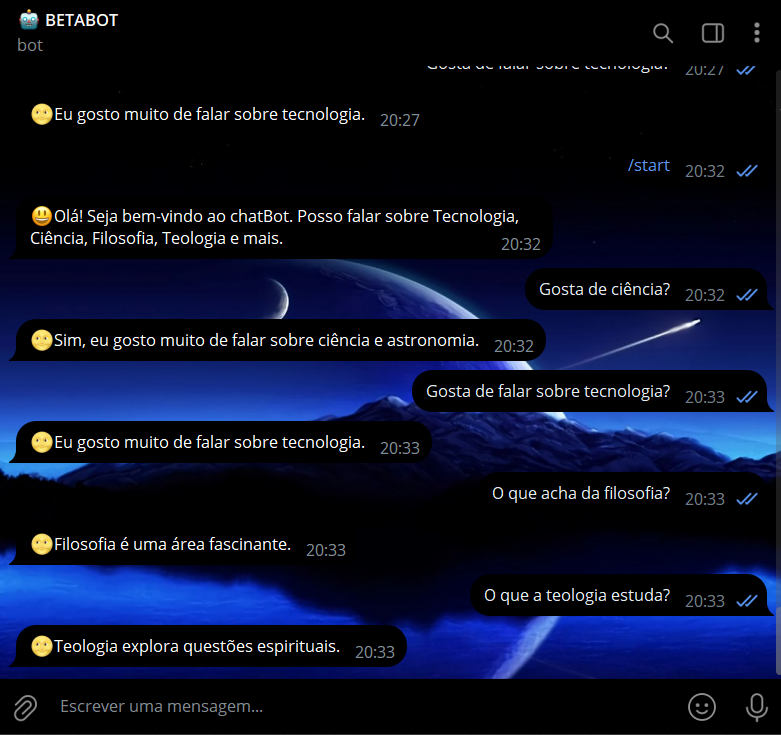
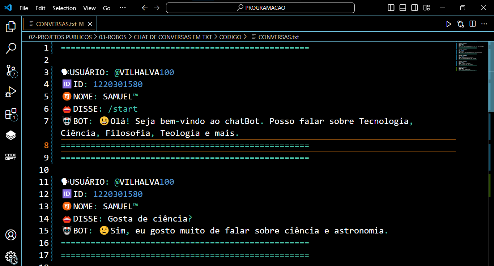

# CHAT DE CONVERSAS EM TXT
🤤É UM BOT DO TELEGRAM DE BATE PAPO SOBRE TÓPICOS RELACIONADOS, QUE SALVA AS CONVERSAS EM "CONVERSAS.TXT"!

 <br>
 <br>

## DESCRIÇÃO:
Este bot do Telegram é projetado para responder a mensagens enviadas pelos usuários com base em palavras-chave predefinidas. Ele armazena as conversas em um arquivo de texto e permite que os usuários personalizem as respostas sem alterar o código principal.

## FUNCIONALIDADES:
1. **Resposta Automática:**
   - O bot responde automaticamente a mensagens com base em palavras-chave definidas em um arquivo separado (`RESPOSTAS.py`).

2. **Registro de Conversas:**
   - O bot salva cada interação em um arquivo de texto (`CONVERSAS.txt`), registrando o nome do usuário, ID, mensagem enviada e resposta do bot.

3. **Personalização de Respostas:**
   - As respostas são definidas em um arquivo (`RESPOSTAS.py`), permitindo fácil personalização das palavras-chave e respostas.

4. **Verificação Contínua:**
   - O bot verifica continuamente novas mensagens usando a API de bots do Telegram.

## EXECUTANDO O PROJETO:
1. **Coloque o Token:**
   - Antes de executar o programa, é necessário substituir o token do seu bot no arquivo `TOKEN.py`, o qual pode ser obtido por meio do [@BotFather](https://t.me/BotFather).

2. **Instalando as dependências:**
   - Antes de executar o bot, certifique-se de instalar todas as dependências necessárias. No terminal, execute o seguinte comando para instalar as dependências listadas no arquivo `requirements.txt` em `CODIGO`:
   ```bash
   pip install -r requirements.txt
   ```

3. **Inicie o Bot:**
   - Execute o bot do Telegram em Python iniciando-o com o seguinte comando:
   ```bash
   python CODIGO.py
   ```
   
   - Inicie o bot enviando o comando `/start`. Receba uma mensagem de boas-vindas e Converse.

4. **Personalização de Respostas:**
   - Edite `RESPOSTAS.py` para adicionar ou modificar as palavras-chave e as respostas conforme necessário.

5. **Interação com o Bot:**
   - Envie mensagens ao bot no Telegram e ele responderá com base nas palavras-chave definidas, registrando todas as conversas no arquivo `CONVERSAS.txt`.

6. **Visualizar Conversas Salvas:**
   - Todas as interações entre usuários e o bot são registradas no arquivo "CONVERSAS.txt" no mesmo diretório do script.
   - Você pode abrir este arquivo para revisar as conversas anteriores e as respostas do bot.

## NÃO SABE?
- Entendemos que para manipular arquivos em muitas linguagens e tecnologias relacionadas, é necessário possuir conhecimento nessas áreas. Para auxiliar nesse aprendizado, oferecemos alguns subsidios:
* [VEJA A DOCUMENTAÇÃO](https://core.telegram.org/bots/api)
* [CURSO DE PYTHON](https://github.com/VILHALVA/CURSO-DE-PYTHON)
* [CURSO SUGERIDO](https://github.com/VILHALVA/CURSO-DE-TELEBOT)
* [CONFIRA MAIS CURSOS](https://github.com/VILHALVA?tab=repositories&q=+topic:CURSO)

## CREDITOS:
- [PROJETO BASEADO NO "CHAT DE CONSOLE"](https://github.com/VILHALVA/CHAT-DE-CONSOLE)
- [PROJETO FEITO PELO VILHALVA](https://github.com/VILHALVA)
